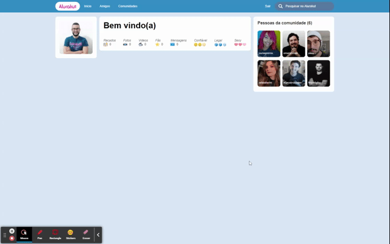

<p align="center">
   
</p>

<p align="center">
  <a href="https://www.linkedin.com/in/brfeitoza/">
    
  </a>
  
</p>

<p align="center">
  This is a clone of the nostalgic social network Orkut
</p>

<p align="center">This project was developed during the Alura Immersion with Next.js and Styled Components</p>

# Contents

- [Demo](#demo)
- [Technologies](#technologies)
- [Getting started](#getting-started)
- [Components docs](#components-docs)
- [Running tests](#running-tests)
- [Issues](#issues)
- [Contributing](#issues)
- [License](#license)

# Demo

<div align="center">
   
</div>

# Technologies

This project was made using the follow technologies:

- [React](https://reactjs.org/)
- [Next.js](https://nextjs.org/)
- [TypeScript](https://www.typescriptlang.org/)
- [Storybook](https://storybook.js.org/)
- [Jest](https://jestjs.io/)
- [React Testing Library](https://testing-library.com/docs/react-testing-library/intro/)
- [Prettier](https://prettier.io/)
- [EditorConfig](https://editorconfig.org/)
- [Husky](https://www.npmjs.com/package/husky)
- [Commitlint](https://github.com/conventional-changelog/commitlint)

# Getting started

```bash
# Clone Repository
$ git clone https://github.com/brfeitoza/alurakut.git && cd alurakut

# Install Dependencies
$ yarn

# Fill .env.local file with YOUR environment variables, according to .env.example file.

# Run Aplication
$ yarn dev
```

Go to http://localhost:3000/ to see the application running.

# Components docs

```bash
# Run storybook
$ yarn storybook
```

# Running tests

```bash
# Run the tests
$ yarn test

# Run the tests in watch mode
$ yarn test:watch
```

# Issues

Create a <a href="https://github.com/brfeitoza/alurakut/issues">new issue report</a>, it will be an honor to be able to help you solve and further improve our application.

# Contributing

This project follows the Angular Convention commits pattern. [Click](./commitlint.config.js) to see the available prefixes.

- Fork this repository;
- Create a new branch to develop your feature: `git checkout -b my-feature`;
- Commit your changes: `git commit -m 'feat: my new feature'`;
- Push to your branch: `git push origin my-feature`.

# License

This project is under the [MIT License](./LICENSE) |
Made with 💖 by [Bruno Feitoza](https://www.linkedin.com/in/brfeitoza/).
